# Essbase Features: Basic

## Introduction

This lab walks you through the major features of Essbase-19c and their functionalities across the platform along with Overview of the Essbase 19c Web interface.

The approximate time to complete the lab is 20 minutes.

### Objectives

 * Understand the Essbase 19c add-ins (Smart View and Cube designer)
 * Understand the 19c Web-interface overview.

### Prerequisites

This lab requires:

* An Oracle Public Cloud account-Essbase 19c instance
* Service administrator role
* Windows Operating System for Essbase add-ins (Smart View and Cube Designer)

*Note:* Whenever there is a “Name” being assigned to any Resource / Application / Cube or to any database in this lab please follow the naming convention as “Sample_<FIRST_NAME>” to avoid duplication.

## **Step 1:** Creating a Sample Application in Essbase19c

1.	Login to the Essbase 19c web interface  using the corresponding Essbase endpoints. i.e. https://ip/essbase/jet

2.	On the Applications tab click on “Import” option from the Essbase web interface as shown below.

    

3.	 From the Import dialog box, click Catalog.

    

4.	Select “Sample_Basic.xlsx” file  from Catalog -> All Files -> Gallery Templates.

    

5.	Name the application “DynamicCorp,” and name the cube (database) “Sales” and click OK.

    

6.	Now we can see an application is deployed and its status.

    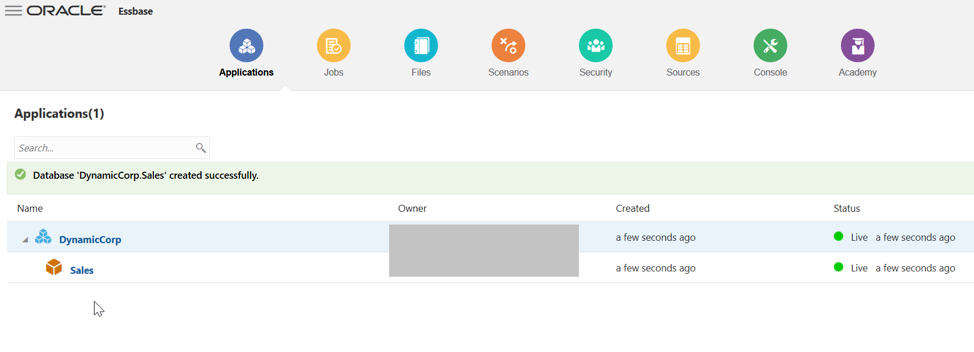

This concludes the creation of sample application from the “Catalog” in the Essabase 19c User Interface.

## **Step 2:** Analyzing Essbase data using Smart View Add-ins

In this section, we will be doing the following -

* Connect to Data Sources
* Explore the Smart View interface
* Create ad hoc grids
* Use Audit Trail

After installing Oracle Smart View for Office, you can create connections to Essbase. Connections require information about the server and port. Your administrator should provide you with the information you need to create the connection. Use the quick connection method to create a private connection to
Essbase.

*To create a private connection using the quick connection method:*

1. In Excel, select the Smart View ribbon, and then click Panel.

2. On the Smart View Panel, click the arrow on the Switch to button, and then select Private Connections from the list.

    

3. In the text box that opens, enter the URL for the data source to which you want to connect. The URL syntax: `https://ip/essbase/smartview`

4. Click Go, or press Enter. (You will receive alert for certificate error. This is expected behavior as for the purpose of this tutorial we are using an Essbase 19c deployment with a demo certificate. Once you're in a post deployment / production instance we replace the demo certificate with a paid SSL certificate and you wont get this alert. For instance, click yes on the alert to continue with this lab exercise.)

5. On the login window, enter your login credentials.

    

6. After successful login, you can now begin working with data in Essbase. Expand ‘EssbaseCluster,’ navigate to the ‘DynamicCorp’ application. Double click on the ‘Sales’ database.

    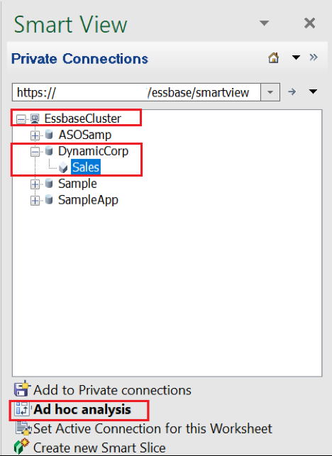

7. You will be presented with the option to create ad hoc grid. Click Ad hoc analysis.

## **Step 3:** Create Ad Hoc Grids

    

**Smart View Ribbon**

The Smart View ribbon option enables you to set Smart View options and perform commands that are common for all data source providers.

**Essbase Ribbon**

The Essbase ribbon contains commands that enable you to view, navigate, and analyze Essbase data.

**POV Toolbar**

Dimensions that are not displayed in columns or rows of a data grid are displayed on POV toolbar, which identifies a slice of the database for a grid. For default ad hoc grids, all database dimensions are displayed on the POV toolbar at the dimension level

**Smart View Panel**

You use Smart View panel to connect to your smart view data sources and manage connections.

1. Bring up Excel. Click Smart View – Panel – Private Connections. Enter the provided Smart View URL. Supply the credentials.

2. In the Connection Manager panel to your right, click ‘DynamicCorp’ – ‘Sales’. Click Connect. Click Ad hoc analysis.

    

3. After connecting to an Essbase server and opening a worksheet, you can initiate ad hoc reports against databases on the connected server. A report initiated at the database level on an empty worksheet returns data from the top levels of each database dimension.

    

4. Double click or zoom in to Measures and Year. You will now see the measures broken down by Quarters.

    

    

5. Go to Year. Click on Zoom in – All levels. You will now see the numbers broken down to leaf level Months. ‘Zoom in’ drills down to display details. To zoom in on a member, perform one of the following actions:

    a. Select the member and then, on the Essbase ribbon, click Zoom In.
    b. Double-click the member.

    

    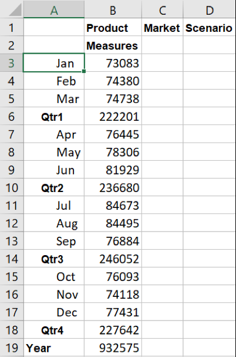

6. Double Click (or Click Zoom in): Measures – Profit – Margins – Sales. Go to Sales. Click Keep Only. Now you are analyzing only Sales numbers and you have removed the rest from your sheet.

    

7. In the Smart View ribbon click Undo. Undo reverses the last change you made to the data.

    

8. In the Smart View ribbon click ‘Redo’. It will take you back to the sheet prior to the ‘Undo’.

9. Pivot to POV:

    a. Click on ‘POV’ in ‘Essbase’ ribbon.

    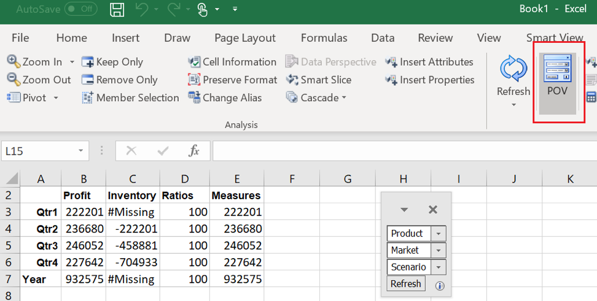

    b. Click the down arrow next to Market. Select New York.

    

    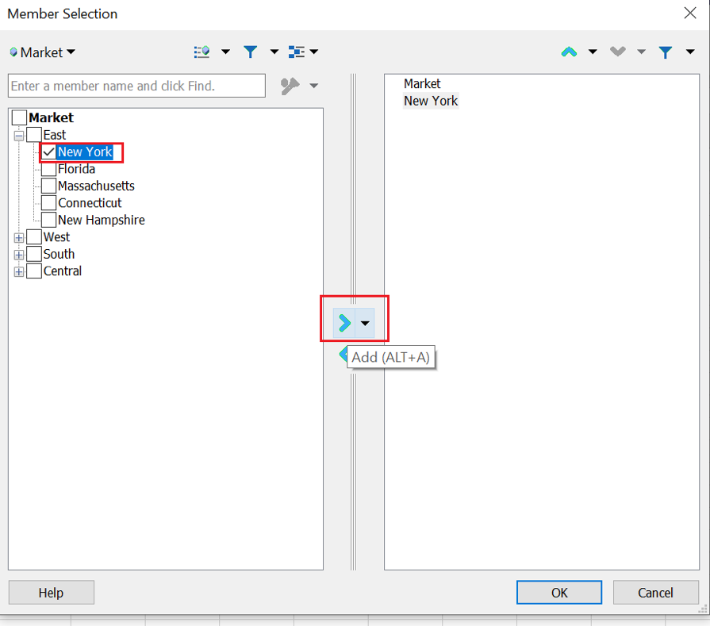

    c. Select New York in the POV toolbar, and click Refresh to see the figures refreshed in the sheet for New York.

    

10. Member Selection:

    a. Drag Scenario from POV tool bar to the sheet.

    

    b. Click on Scenario

    c. Click on Member Selection in the Essbase ribbon. Select Actual.

    

    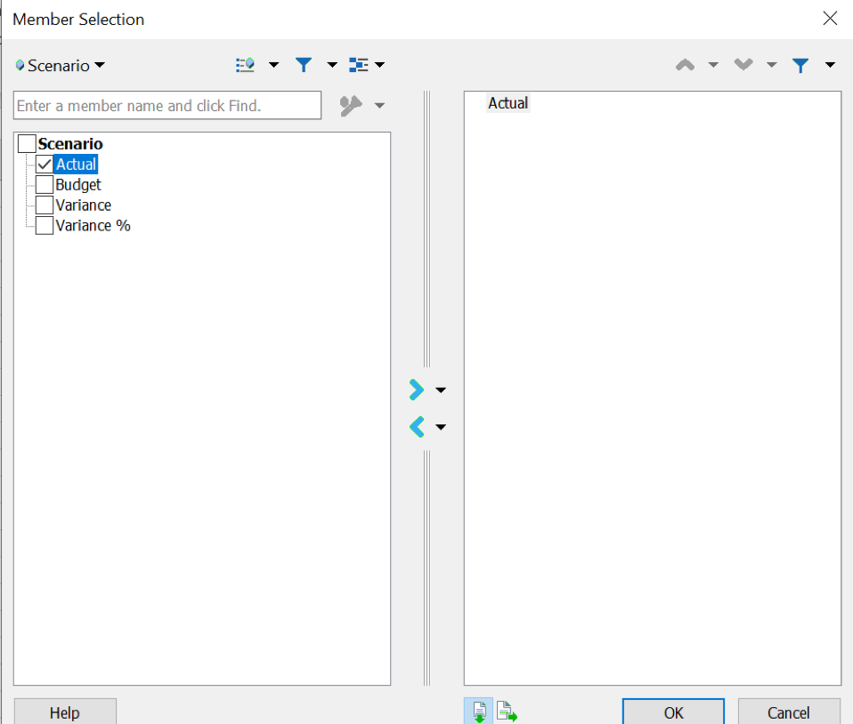

11. Free Form processing:

    a. You can free form type a member combination on a sheet. Click Refresh. The sheet will be updated to show the results of the query in your free form sheet.

    b. Start by creating smart view analysis report.

    c. Create report by zooming into the Year & Measures dimension.

    

12. You can directly enter Sales account member in place of Profit to visualize sales data across year without needing to perform member selection.

13. Click the Profit cell, replace with Sales, hit and select refresh.

    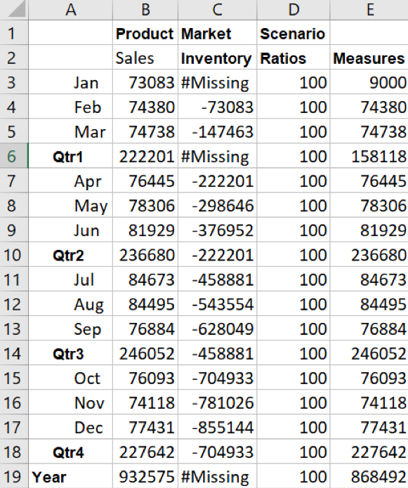

## **Step 4:** Install the Smart View Cube Designer Extension

1. On the ‘Smart View’ ribbon, select ‘Options’, and then ‘Extensions’.

    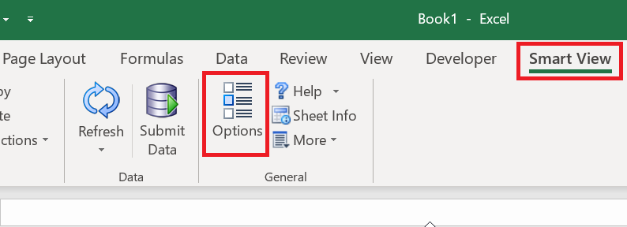

2. Click the ‘Check for updates’ link. Smart View checks for all extensions that your administrator has made available to you.

    

3. Locate the extension named Oracle ‘Cube Designer’ and click ‘Install’ to start the installer.

4. Follow the prompts to install the extension.

5. Now, in the Essbase 19c web interface , click ‘Console’.

6. On the ‘Desktop Tools’ tab, to the right of Cube Designer Extension, click ‘Download’.

    

7. In the ‘CubeDesignerInstaller.svext’ dialog box, select ‘Save File’ and click ‘OK’. Save the file to a local directory.

    

8. Close all Microsoft Office applications and make sure Microsoft Office applications are not running in the background.

9. Double click the ‘CubeDesignerInstaller.svext’ file we downloaded to local directory.

10. Restart Microsoft Office applications.

## **Step 5:** Creating a Cube from Tabular Data in Cube Designer

* This workflow uses two sample tabular data Excel files to demonstrate the concepts of intrinsic and forced-designation headers. See About [Using Tabular Data to Create Cubes](https://docs.oracle.com/en/cloud/paas/analytics-cloud/esugc/using-tabular-data-create-cubes.html)

1.	In Excel, on the ‘Cube Designer’ ribbon, click ‘Catalog’.

2.	On the Cloud Files dialog box, under Catalog, go to ‘gallery/Technical/Table Format’ as shown below, then select a sample tabular data file: `Unstr_Hints.xlsx: Intrinsic headers`

    

3.	Double click on the above directed file.

4.	On the `Cube Designer` ribbon, select `Transform Data`

5.	On the `Transform Data` dialog box, enter an application and cube name, if you want to change the default names that are prepopulated.

    

6. The application name is based on the source file name without the extension and the cube name is based on the worksheet name.

    `Unstr_Hints.xlsx: Application name is Unstr_Hints and the cube name is SpendHistory`

7.	Click `Preview Data` The workbook is sent to Essbase 19c for analysis and the relationships are returned for viewing.

8.	When you are ready to create the cube, click `Run`

9.	  (Optional) When asked if you want to see the cube job status, click `Yes`

    

10. The newly created application and cube are listed on the Applications home page in the cloud service and are available in Cube Designer. Now that the cube has been created from the tabular data, you can export the cube to an application workbook.

11.	On the `Cube Designer` ribbon, select `Private / Local` , then select `Export Cube to Application Workbook`

    

12.	On the `Export Cube to Application Workbook` dialog box, select the application and cube, and then select `Run`

    

* To create a cube in Essbase the cloud service, see *Creating a Cube from Tabular Data*.

* In this exercise, you saw how a normal flat file Excel sheet can be converted into an Essbase application and a cube. You could get the application workbook DBX (Design by Example) file in a matter of seconds with the dynamic capabilities of Essbase powered by the Cube Designer add-ins.

## **Step 6:** Overview of the WEB-User Interface

### Applications:
1. Applications tab gives us the information about the Essbase applications and the cubes built under them.

    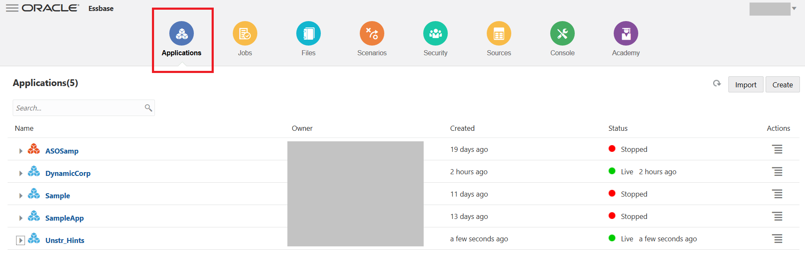

2. Here, we will also find options to explore the features available under each application & cube using the inspect option as below. The Application specific audit/logs, Application specific configuration files etc are available in the ‘Applications’ tab under ‘Inspect’ option.

3. By choosing the Inspect option for each application, you can see application specific logs, audit files, configuration files, etc.

    
    

4. You can access outlines and specific cube options by choosing the Inspect menu item for each cube.

    
    

5. Outline Analysis: The Outline option is equivalent to the EAS console on in Essbase on-premises. This is where you can add new dimensions or members under dimensions on at any level, as required, and can make changes to existing cubes quickly using the ‘Edit’ option. Select the ‘Outline’ option for the ‘SpendHistory’ cube. [or any cube that is already LIVE on the Essbase 19c web interface ].

    
    

6. Here, add a new child called ‘TotalA’ under the ‘Measures’ dimension member as shown below. Let us now assign an ‘Ignore’ Consolidation operator to the ‘TotalA’ member. The operator defines the way in which the new member rolls up across the hierarchy.

    
    

7. We now have to add a formula to this new dimension using the pencil icon under the ‘formula’ tab as shown. We are adding ‘Spend’ and ‘Invoice’

8. Once added, we need to verify the formula and then select Apply and Close.

    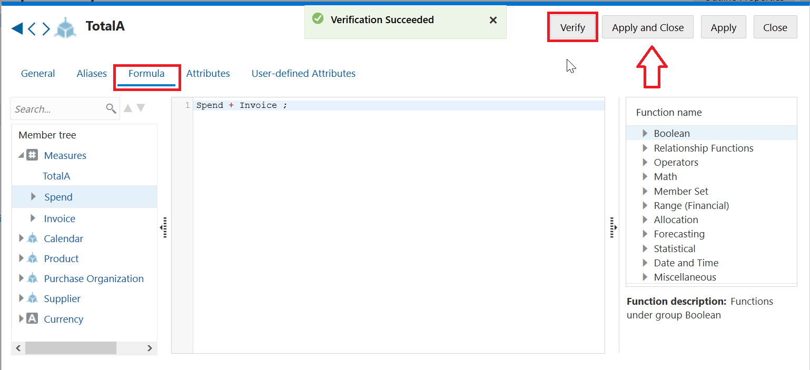

9. You can also specify other options such as Data storage type and ‘Sort/Inspect’ of members in a dimension using the options in the web interface. You can use the ‘Skip’ option to skip missing values as shown below. Save all the changes you made.

    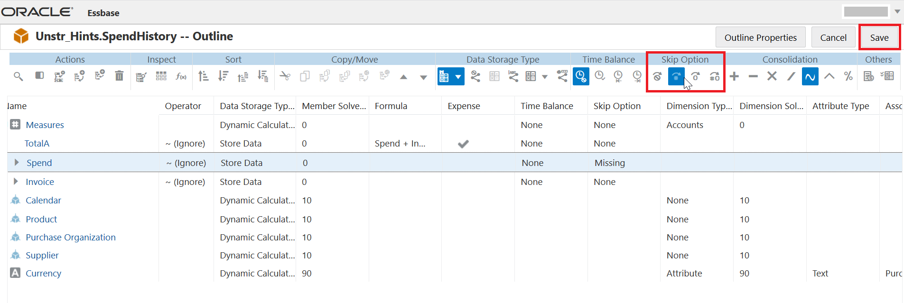

### Jobs:

1. The Jobs tab displays all the information about the jobs that have been executed on in the Essbase web interface. The display of Jobs serves as an Audit of all the tasks done on the Essbase web interface.
You can create and run new jobs on applications and cubes using this tab, as shown below.

    

2. Execute a Build Dimension job by selecting the application and cube, as shown below. The ‘Script’ file is the rule[.rul] file where the dimension build script exists. Select the pre-existing ‘DimBuild.rul’ file and its corresponding ‘DimensionsCSV.txt’ pair as the Data File and execute the job.

    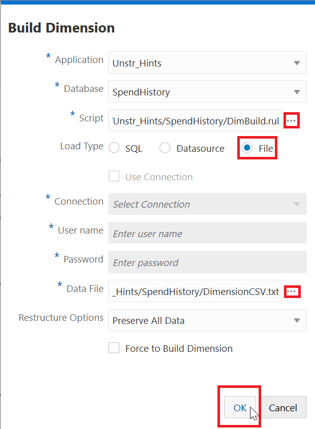

3. Once the job is running, you can see the status of the job in the Essbase web interface. You can view the job details under Actions  for the job executed.

    

### Files:

1. The Files tab is equivalent to the file directory of Essbase. This is where you find all the files related to applications and cubes under the “applications” folder.

    

2. On the Files tab you can upload the artifacts/files related to Essbase, such as script files, rule files, load files etc. existing on local systems directly into the cube of our choice using the ‘Upload Files’ option under the corresponding cube path. [In the image below, the application name is ‘Sample’ and the cube name is ‘Basic’]

    

3. The ‘Gallery’ folder on the ‘Files’ tab has industry wide sample templates in dbx format that are ready to use. They help you kickstart the process of building cubes related to that specific industry very quickly.

    
    

### Scenarios:

1. The ‘Scenarios’ tab is where you create scenario modeling on the applications for ‘What-If’ analysis, which empowers the users to analyze the data and get insights from the data. [More on this will be covered in an upcoming lab. ]

### Security:

1. The ‘Security’ tab holds the information about the users in Essbase and the roles they’re assigned. You can change the level of access assigned to a particular user.

2. You can add new users/groups by clicking on the ‘Add Role’ option.

    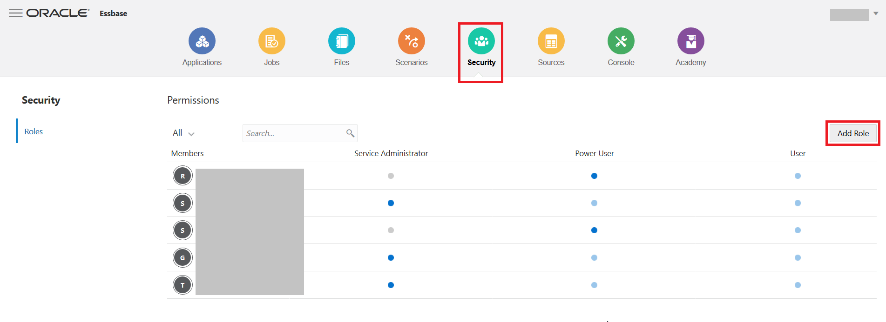

### Sources:

1. Many cube operations require connection information to access remote source data or hosts. You can define ‘Connections’ and ‘Datasources’ once and reuse them in various operations, so that you don’t have to specify the details each time you perform a task. A connection stores login credentials required to access an external source. Essbase 19c allows connections to the Datasources shown below. A Datasource points to an external source of information.

    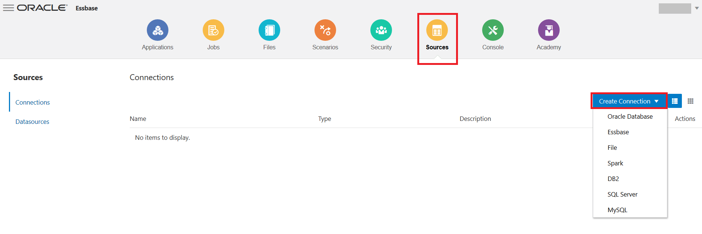

### Console:

1. The Console tab is one stop place for Essbase Administrator tools such as:

    *	Export Utility: Command-Line tool for exporting the outline of a cube and other related elements into a application workbook.
    *	LCM: Life-Cycle Management tool is used for backing up and restoring the Essbase artifacts
    *	Command-Line Tool: CLI utility for Cloud Essbase platform
    *	Migration Utility: This utility is used for migrating Essbase artifacts  between Essbase instances and environments. This tab also contains the download links for Smart View and Cube Designer add-ins. Extensions and Essbase Client tools such as MaxL, Java API, and othersnder are also available in the Desktop Tools section.

    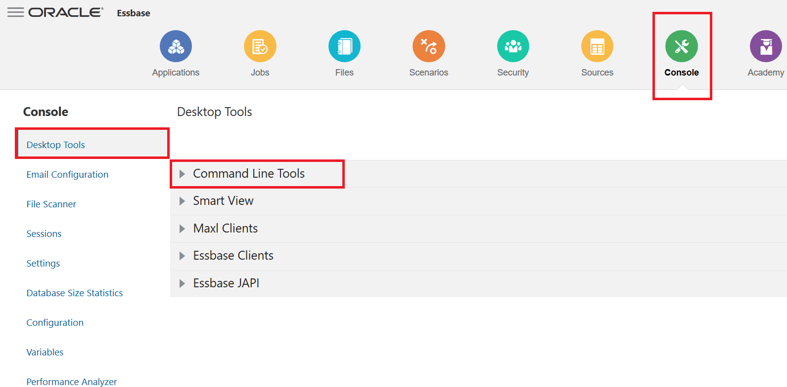

    * ‘Console’ tab also holds the information regarding session login by users, settings of the Essbase environment, email configuration settings etc.
    * The ‘Global configuration’ file of Essbase is available directly from the Essbase Web-user interface as shown, where we can add new variable property settings with corresponding values using ‘Add’ option.

    

### Academy:

1. This tab contains all the information and documentation links related to Essbase 19c

    

You may proceed to the next lab.

## Acknowledgements

* Author - NATD Cloud Engineering - Bangalore Analytics (Aparana Gupta, Sushil Mule, Sakethvishnu D, Mitsu Mehta, Fabian Reginold, Srikrishna Kambar)
* Reviewed by - Ashish Jain, Product Management
* Last Updated By/Date - Jess Rein, Cloud Engineer, Sept 2020

## See an issue?
Please submit feedback using this [form](https://apexapps.oracle.com/pls/apex/f?p=133:1:::::P1_FEEDBACK:1). Please include the *workshop name*, *lab* and *step* in your request.  If you don't see the workshop name listed, please enter it manually. If you would like for us to follow up with you, enter your email in the *Feedback Comments* section.
